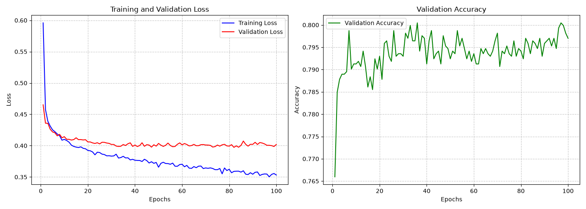

<div align='center'>

# Spaceship Titanic Classification


</div>

## Project Overview
The project was made for the Kaggle [Spaceship Titanic Competition](https://www.kaggle.com/competitions/spaceship-titanic/data).

The goal of this project is to predict whether a passenger was transported based on their personal information.

## Data Preprocessing
After performing [EDA](notebooks/eda.ipynb) the following choices were made:
- Divided the feature `Cabin` into three more features: `Deck, Num, Side`.
- Defined a new feature `TotalSpend` that aggregates the total money spent.
- Defined a new feature `GroupSize` based on the amount of people in the same group; The group was obtained from the `PassengerID`.

Null values were replaced with the median for numerical features and the mode for categorical features.

One-Hot Encoding was used for categorical features. Numerical features were scaled using `Scikit-Learn`'s `StandardScaler`.

## Model Architecture
Defined a **MLP** (multi-layer perceptron) using `PyTorch`, below the summary of the model:
```
==========================================================================================
Layer (type:depth-idx)                   Output Shape              Param #
==========================================================================================
SpacechipTitanicMLP                      [256, 1]                  --
├─Sequential: 1-1                        [256, 1]                  --
│    └─Linear: 2-1                       [256, 64]                 1,920
│    └─ReLU: 2-2                         [256, 64]                 --
│    └─Dropout: 2-3                      [256, 64]                 --
│    └─Linear: 2-4                       [256, 32]                 2,080
│    └─ReLU: 2-5                         [256, 32]                 --
│    └─Dropout: 2-6                      [256, 32]                 --
│    └─Linear: 2-7                       [256, 1]                  33
│    └─Sigmoid: 2-8                      [256, 1]                  --
==========================================================================================
Total params: 4,033
Trainable params: 4,033
Non-trainable params: 0
Total mult-adds (Units.MEGABYTES): 1.03
==========================================================================================
Input size (MB): 0.03
Forward/backward pass size (MB): 0.20
Params size (MB): 0.02
Estimated Total Size (MB): 0.24
==========================================================================================
```

## Model Evaluation
The following is the graph plotting the performances of the model:



The model reached its lowest validation loss at **epoch 80**, after that it started showing signs of **overfitting**.

The model saved is automatically the one with the lowest validation loss.

The final model achieved a validation loss of $\approx 0.4$ and a validation accuracy of $\approx 80%$

## How to use
Clone the repository:
```bash
git clone https://github.com/PinaDaniele/Spaceship-Titanic
cd Spaceship-Titanic
```

Install the dependencies (pip):
```bash
pip install -r requirements.txt
```

install the dependencies (uv):
```bash
uv venv
.\venv\Scripts\Activate
uv pip install -r requirements.txt
```

Run the training:
```bash
cd src
python train.py
```
